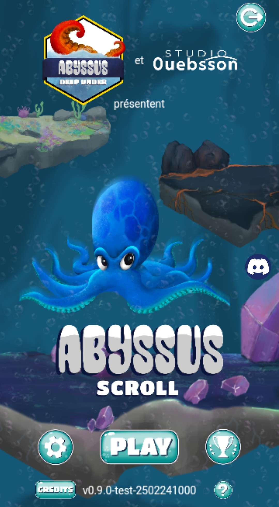

# Abyssus Deep Under

A 2D isometric MMO RTS/4X Game.

## Description

It is a [Studio Ouebsson](https://studio.ouebsson.fr/) game, developped in Typescript and PHP with Phaser.

You play as an Octaly (an octopuss-like intelligent being) in a submarine persistent world. You start with your own virgin  territory. Your goal is to eXploit the ressources of this territory, eXtend it, eXplore the world and eXterminate your oponents (4X game). Other players will compete with you in real time, so you will have to plan your strategy well !

    

## How to play

The game is still under development, it will be playable on mobiles and computers.  
You can find the official website [here](https://www.abyssus-deep-under.com).

## Back to Portfolio

[Back](https://wickiriama.github.io)
