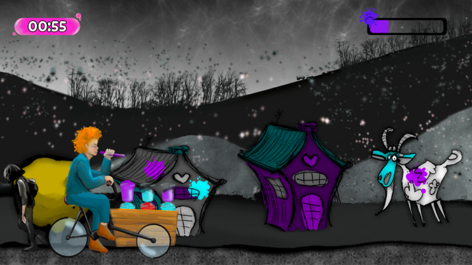

# Bubble Tearapy

A 2D point and click scrolling game.

## Description

It is a team project, developped in Typescript and PHP with Phaser for the 2025 [Gobal Game Jam](https://globalgamejam.org/).

In a bleak, monochrome world where happiness is nothing but a distant memory, you play the inventor of bubble tea: the first ever colored drink.
Hop on your bike, go around the city and share color with everyone to bring them back their happiness!

You win the game once the entire town is colored!

## How to play

Press Space to go faster  
Aim with the Mouse  
Left-click to shoot bubbles  
Hold Left-click to shoot a bigger bubble  
Left-click on one of the cups on the bike to reload

### On the Gobal Game Jam Website
[Click here](https://globalgamejam.org/games/2025/bubble-tearapy-5)

## Back to Portfolio

[Back](https://wickiriama.github.io)
