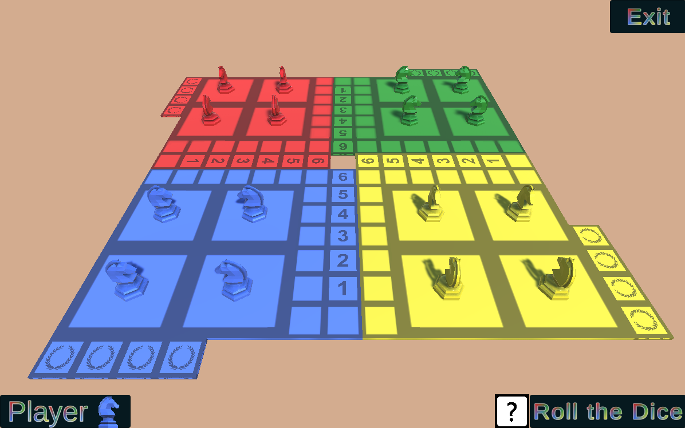

# French Ludo / Les petits chevaux

A 3D boardgame

## Description

It is a personnal project, developped in C# with Unity.

The game is an adaptation of the French boardgame "Les petits chevaux" (The little horses).

You can play with between 1 and 4 players, on the same screen (or with 0 player if you just want to watch the AI play).

The goal is to make a 6 to get out of your stable, go around the board and then get up your final stairs by making the right numbers with the dice.

A horse can't be on the same tile than an other horse or pass through another horse.
If a horse doesn't have enough space to move according to the dice result, he won't move at all.
You can eat an opponent's horse by landing exactly on it. In this case, the opponent's horse will return to its stable.

## How to play

### On navigator
[Click here](https://wickiriama.github.io/French_ludo/)

### On Windows (full screen)

- Download the Build_Windows repository
- Double click on the *Little Horses.exe* file

## Back to Portfolio

[Back](https://wickiriama.github.io)
