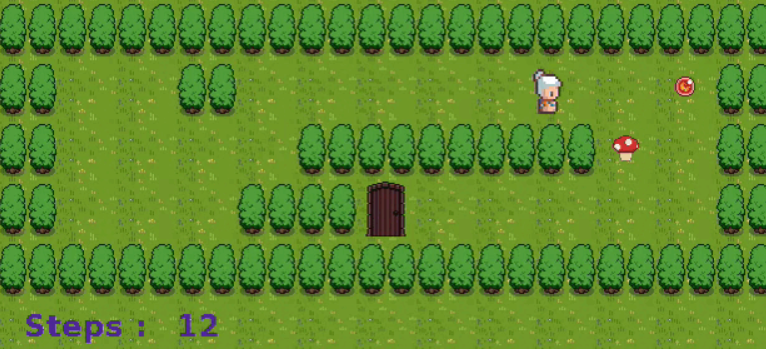

# CV

[My CV](./assets/CV_Margaux_Riant.pdf)

# Personnal Project

## French Ludo / Litte Horses

A 3D boardgame

It is a personnal project, developped in C# with Unity.

[Play Little Horses](./FrenchLudo.html)

# School Projects

## soLong

A 2D isometric game.

It is a 42 school project, developped in C with the school graphic library, the minilibx.

[Play SoLong](./soLong.html)

## miniRT

A basic ray-tracing engine.

It is a 42 school project, developped in C with the school graphic library, the minilibx.

 

[See miniRT](./miniRT.html)
