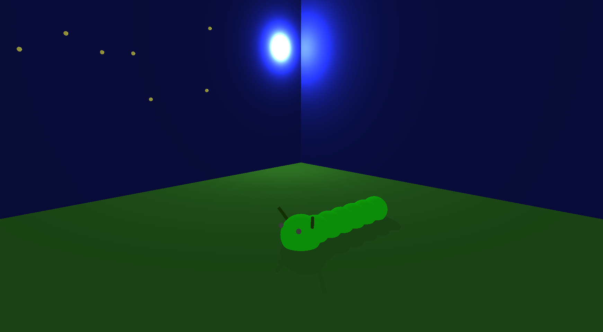
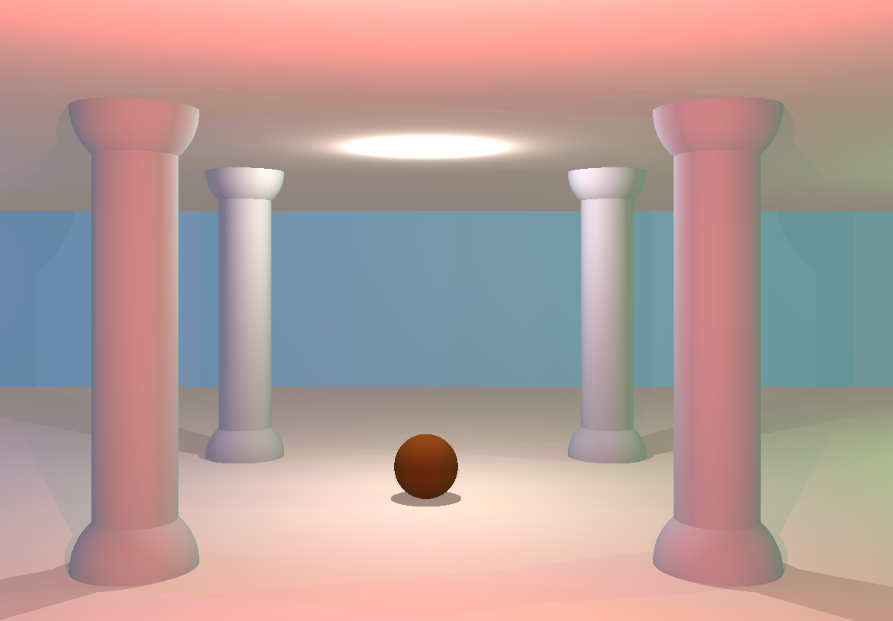

# Personnal Project

## Litte Horses

# French Ludo / Les petits chevaux

A 3D boardgmae

It is a personnal project, developped in C# with Unity.

[Play Little Horses](./FrenchLudo.html)

# School Projects

## soLong

A 2D isometric game.

It is a 42 school project, developped in C with the school graphic library, the minilibx.

[Play SoLong](./soLong.html)

## minirt

A basic ray-tracing engine.

It is a 42 school project, developped in C with the school graphic library, the minilibx.

You can generate static scenes composed of plans, sphere or cylinders. There can be several light sources, with different colors.
 

