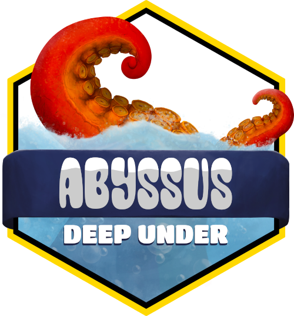
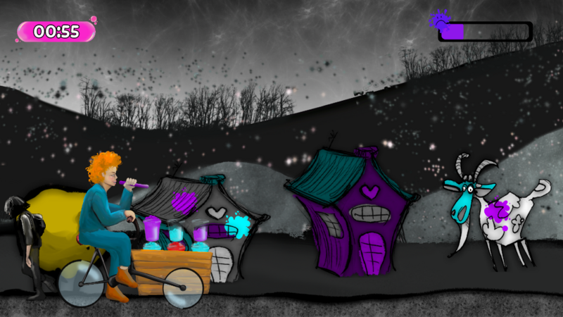
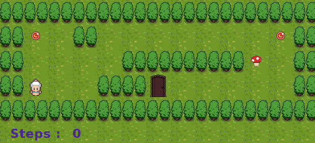

# CV

[My CV](./assets/CV_Margaux_Riant.pdf)

# Studio Ouebsson

I did a 6 months internship at [Studio Ouebsson](https://studio.ouebsson.fr/).
I had the opportunity to work on two games: Abyssus Scroll and Abyssus Deep Under.

## Abyssus Scroll

A 2D vertical platformer.

    

[Play Abyssus Scroll](./AbyssusScroll.html)

## Abyssus Deep Under

A 2D isometric MMO RTS/4X Game.

    

[Know more about Abyssus Deep Under](./AbyssusDeepUnder.html)

# Personnal Projects

## Bubble Tearapy

A 2D point and click scrolling game.

It is a GameJam project, developped in Typescript and PHP with Phaser.

[Play Bubble Tearapy](./BubbleTearapy.html)

## French Ludo / Litte Horses

A 3D boardgame

It is a personnal project, developped in C# with Unity.

[Play Little Horses](./FrenchLudo.html)

# School Projects

## soLong

A 2D isometric game.

It is a 42 school project, developped in C with the school graphic library, the minilibx.

[Play SoLong](./soLong.html)

## miniRT

A basic ray-tracing engine.

It is a 42 school project, developped in C with the school graphic library, the minilibx.

 

[See miniRT](./miniRT.html)
