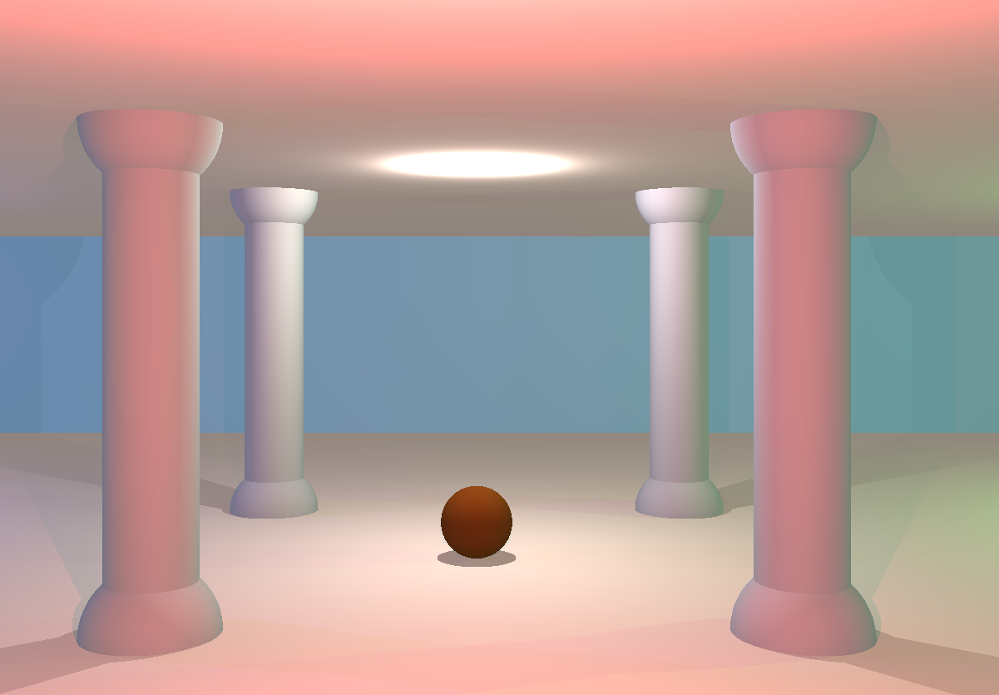

# miniRT

A basic ray-tracing engine.

## Description

It is a 42 school project, developped in C with the school graphic library, the minilibx.

You can generate static scenes composed of plans, sphere or cylinders. There can be several light sources, with different colors.

 


## Getting Started

### Dependencies

* A Linux distribution
* X11

### Installing

 ```
 git clone https://github.com/WickiRiama/SoLong.git
 ```


### Executing program

* Go into the minirt folder created by the `git clone` command.
* Make the project
* Run the miniRT executable created with one of the scenes in the scenes folder.

```
cd minirt
make
./miniRT scenes/caterpillar.rt
```

### Generating new scenes

* Create a new .rt file in the scenes folder.
* Add the mandatory elements
  * Add an ambiant light: ```A  0.6  250,250,250```.
    * `0.6` is the ambiant lighting ratio (in range [0.0, 1.0]) and `250,250,250` the RGB color (in range [0, 255]).
  * Add a camera: ```C  0,6,-30  0,0,1  70```.
    * `0,6,-30` are the x,y,z coordinates of the camera position, `0,0,1` the orientation vector and `70` the horizontal field of view (FOV, in range [0, 180]).
  * Add a main light: ```L  0,6,-23  0.6  255,60,60```.
    * `0,6,-23` are the x,y,z coordinates of the main light position, `0.6` the main light brightness ratio (in range [0.0, 1.0]) and `255,60,60` the RGB color (in range [0, 255]).
* Add other elements as you wish amongst:
  * spheres: ```sp  0,0,0  2  115,61,19```.
    * `0,0,0` are the x,y,z coordinates of the sphere center position, `2` the sphere diameter and `115,61,19` the RGB color (in range [0, 255]).
  * planes: ```pl  0,-1,0  0,1,0  241,222,207```.
    * `0,-1,0` are the x,y,z coordinates of one point of the plane, `0,1,0` the coordinates of a normal vector of the plane and `241,222,207` the RGB color (in range [0, 255]).
  * cylinders: ```cy  7,5,-7  0,1,0  2  10  180,183,184```.
    * `7,5,-7` are the x,y,z coordinates of the cylinder center position, `0,1,0` the coordinates of a cylinder axis vector, `2` the cylinder diameter, `10` the cylinder height and `180,183,184` the RGB color (in range [0, 255]).
  * other lights: ```l  30,6,0  0.4  60,255,60```.
    * `30,6,0` are the x,y,z coordinates of the light position, `0.4` the main light brightness ratio (in range [0.0, 1.0]) and `60,255,60` the RGB color (in range [0, 255]).

## Acknowledgments

This project was a team project, realized with [lmenigau](https://github.com/lmenigau).

42 School graphic library: [minilibx](https://github.com/42Paris/minilibx-linux)

## Github project

[Project](https://github.com/lmenigau/minirt)

## Back to Portfolio

[Back](https://wickiriama.github.io)
